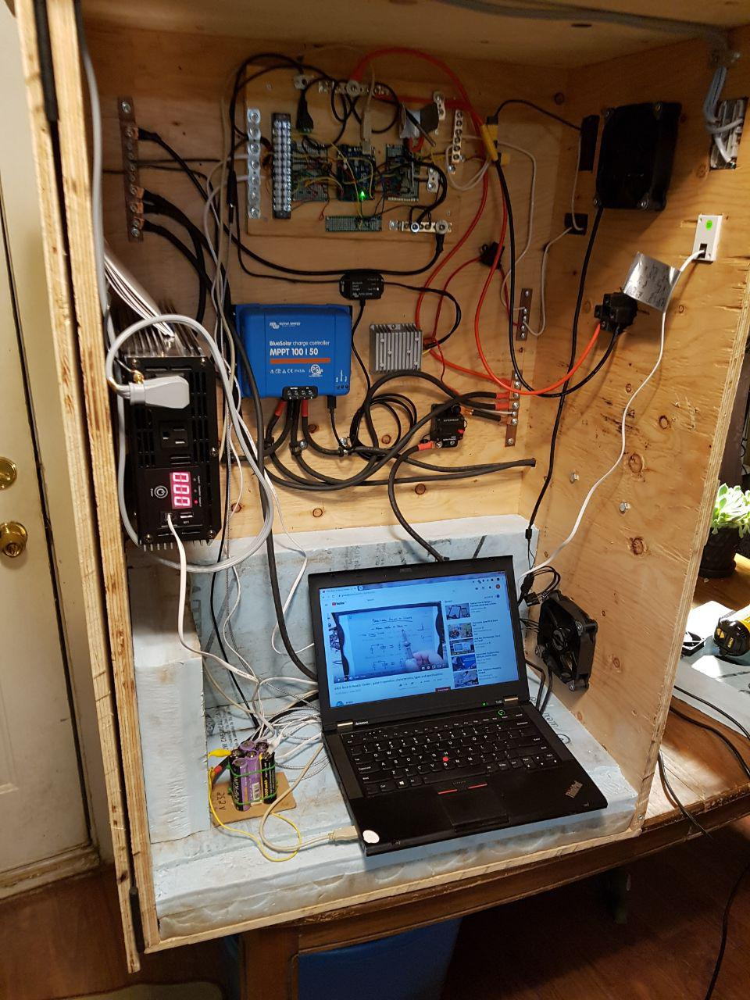
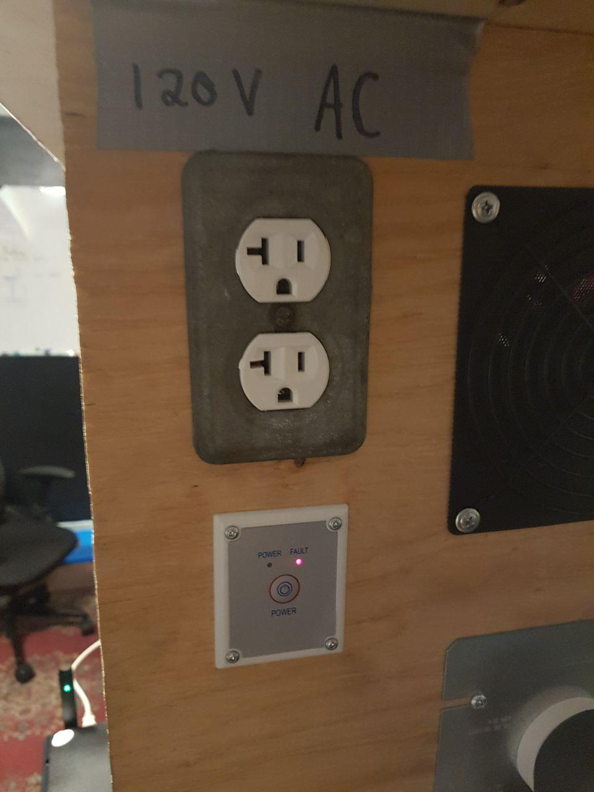

# Solar System Controller Project

Created By:  Matthew Revesz and Philip Kirkbride

Date: Nov. 2, 2019

## Arduino Requirements:
The MPPT Charge Controller(from now on just CC), is used to charge the batteries with the energy from the panels.  Some models of CC have a feature that allows extra energy to be diverted to a dump load when the batteries reach full charge.  This CC does not have this feature, and one goal of the project is to achieve a similar function using the Arduino.  To achieve this the voltage of the battery is probed and sent to one of the analog input pins of the arduino(after being sent through a simple voltage divider circuit to reduce voltage).  Transistors and MOSFETS are used to switch loads on and off.  The loads controlled are: 24V load dump, 12V load, 12V cooling fans, 120V ac inverter.  The inverter is switched on and off using a 3 second pulse.  3 LEDs(Green, Blue, and Red), are used to indicate the status of the arduino.  A BMS(battery management system), is used to keep the cells of the battery balanced, as well as to act as a control signal when voltage is low or high.  The settings on the BMS will low me to send a control signal to the arduino when the voltage is low.  If this happens I can cut loads from the battery.  There is a redundant ability for the arduino to also detect the battery voltage directly and cut loads when voltage is low.  The reason for detecting the battery voltage with the arduino is in order to detect full charge of the batteries and use this as an indication when to activate the 24V load dump.  

The inverter.  The inverter takes 24 volt DC power and converts it to a 120 volt AC waveform just like you get from your wall socket.  Turning the inverter on and off is not as simple as the other loads.  The inverter is intended to be capable of drawing a lot of current from the battery at any given time(200 amp maximum).  Because of this it is not feasible to switch the inverter on and off using transistors(is possible but would reduce efficiency and be expensive for the beefy MOSFETS required).  So to get around this I use the remote button that comes with the inverter.  The remote button is intended to be pushed with a finger and held for 3 seconds, then depressed.  When this is done the inverter either turns off or turns on.  To simulate this action with the arduino turns out to be more complicated than anticipated.  The remote button from the inverter has 4 wires.  One of the four is the Black wire, which will be named blackWire.  blackWire provides a constant DC voltage of ~24 volts.  This wire does not connect to any input of the arduino but it is used later in switching. 
The second wire is redWire.  redWire waits for a connection to blackWire.  When this occurs the 24V from blackWire is detected back at the inverter, and the inverter can turn on or off.  The signal through redWire must be held for 3 seconds or it will be ignored.  It is possible for me to relay a 24 volt signal from the battery to the inverter using this redWire.  However what I will actually do is use blackWire as my source of 24 volts because I do not know exactly how sensitive to voltage the inverter is, and I have noticed that the blackWire voltage is always slightly lower than the actual battery voltage(so blackWire will read 22.4V when the battery is reading 24.5 volts for example).  Because of this when I want to send a ~24v signal to redWire, I will use blackWire as my voltage source.  
The next wire is greenWire.  greenWire is there to provide a path for current to flow to illuminate a green light on the remote button of the inverter.  When the inverter is ON, and there is no FAULT, then the green light should be illuminated.  But this is where I had to get into some circuitry wizardry with my multimeter.  How does greenWire work?  It connects to a transistor inside the inverter.  When the inverter wants to turn on greenWire, it activates the transistor, allowing the transistor to complete the path to ground.  So in normal use, green wire is always directly connected to black wire, but the LED cannot turn on until the path to ground is completed by the transistor inside the inverter.  I will have to mimic something like this because I intend to probe the green wire going to the inverter, and doing so would mean I must deactivate the green wire going to the remote button.  So you see the inverter should normally have 4 wires that connect to a remote button, but for our purpose the 4 wires first go to the arduino, and then a second set of 4 wires leave the arduino and continue on to the remote button.  The activation of the LED on the button will not be by completing the path to ground via the inverter but instead be completed by a transistor which I have installed that connects to the arduino.  I have determined the correct resistor values so that this should work without burning out the LED due to short circuit and over-current.  

Because there will be two sets of 4 wires we can call the ones originating at the inverter the blackWire1, redWire1, etc and the ones going to the push button the blackWire2, redWire2, etc.  

## Code:
Research the “1 wire” protocol.  There will be 3 temperature probes each using “1 wire”.  Each probe has a unique serial code, and multiple data lines can be connected to a single pin of the arduino digital input.  A special library will be needed.  I will have to identify which probe is which and we can label them based on the location that they will be measuring the temperature from.  One will be to measure battery temp, one will measure the case temperature of the electronics case, and a third will measure the water temperature of the load dump to ensure that the load dumping energy does not cause the water to boil.  

There are 2 fans connected to the control circuit.  Each of these will be operated by a single pin in ON mode.  The parameter that should determine if the fans will go on are that 
A)If the case temp is above 25 degrees
B)if the batt temp is a above 25 degrees

Thermometer probe has a data pin.  All three probes connect to the same digital input pin.  
The probe part name is DS18B20.  Tutorials are online. 

Output pins with PWM should be allowed to operate in PWM(pulse width modulation), so that the loads can be adjusted between 0 and 100% rather than just ON and OFF

Some other output pins should not be operated in PWM mode, so code should specifically ensure that they are not outputting in PWM.  

## Analog Inputs

A0 pin (analog pin) - Read voltage drop to Green
A1 pin - Read voltage drop to Yellow
A2 pin - empty
A3 pin - inverter is on when true  (will have to do tests to determine voltage when true)
A4 pin - inverter fault (will have to do same test as for A3)
A5 pin - batt. voltage

Digital outputs/inputs

13 pin - Green drain to ground for LED light
12 pin - Yellow drain to ground for LED light
11 pin - fan control (PWM)
10 pin - 24 volt Load Dump (PWM)
9 pin - 12 volt loads (not PWM)

7 pin - Green LED  << Everything OK
6 pin - Blue LED(PWM)  << Load Dump Active
5 pin - Red LED  << FAULT
4 pin -  Inverter switch ON/OFF (“momentary switch”)  on/off achieved by 3 second pulse signal 
3 pin - - BMS active signal input >>  True = BMS Active,  False = BMS Fault
2 pin - Digital input for 3 temp sensors 

## Program Logic:
If case temp or batt. temp above 25C, turn on fan.  Else, do nothing. 

If water temp above 80C, turn off 24V load dump
If water temp above 5C and below 80C, then water temp is NORMAL
If water temp is below 5C, then water temp is LOW

Load dump logic:  
IF batt is full AND water temp is NORMAL OR LOW, AND season is WINTER, then turn ON 24V load dump

Else do nothing

If batt is LOW, Turn OFF 24V load dump, turn off 12V load, turn off 120Vac load.  

Read status of inverter.  If Green Pin is HIGH, then inverter is ON.  

If inverter is ON or FAULT, and needs to be turned off,  Pulse 3 seconds HIGH to digital pin 3.  
If inverter is OFF and needs to be off,  Do nothing

If Inverter is FAULT, for more than 5 seconds,  Turn off

RED LED FAULT codes:   for ambiguous codes, I can detect what is happening at the panel using my multimeter or infrared camera, these codes will simply help me diagnose more quickly. 
Solid Red  - low or high battery voltage
Blinking 1 seconds on/off - Case OR batt temp HIGH or LOW
Blinking Fast - load dump water temp is HIGH or LOW
Short blip followed by long pause - other
…  will add to this

Battery voltage status:
Low - 2.9 volts per cell
High - 3.5 volts per cell

Inverter communication cable has 4 wires
Black always 24V
Red- Used as a momentary switch for On/Off
Green - sits at 1 to 2 mV when active
Rises to between 1 and 2 V when inactive (1.7 V typical)
Indicated Inverter ON 
Yellow - same as Green, but indicated Fault. 
Green will turn off if Yellow turns on.  
